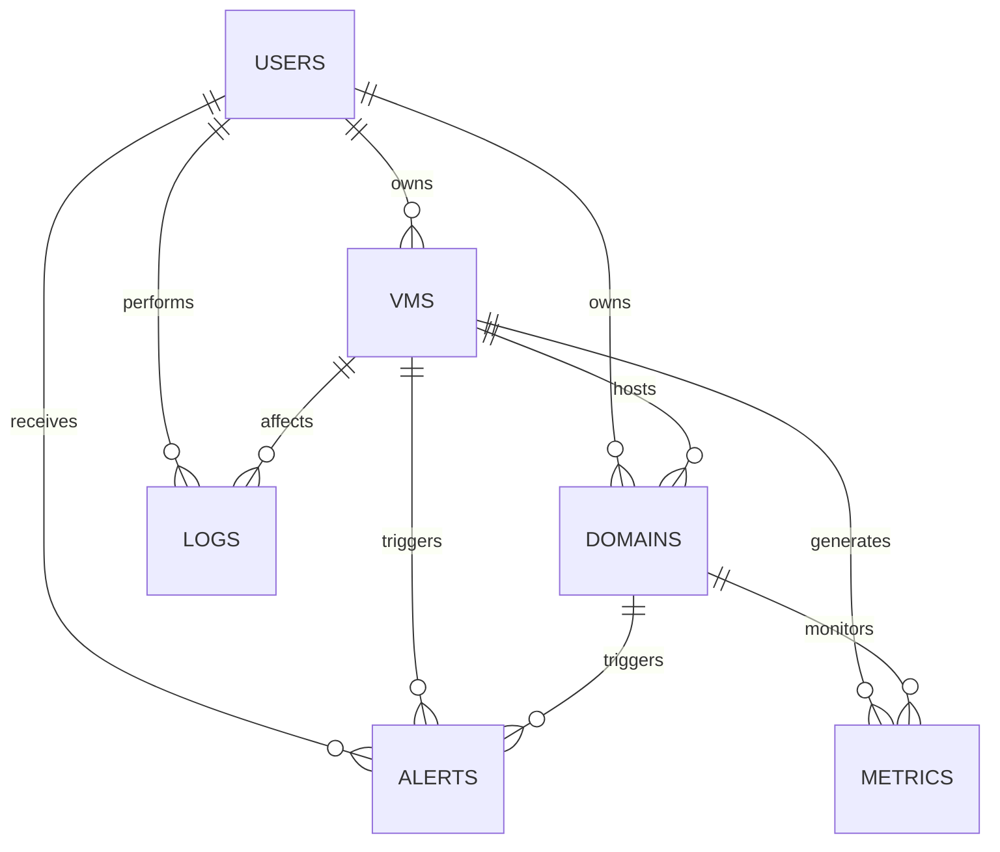

# 📊 VPS Management System - Data Model

## 🏗️ Overview
Hệ thống quản lý VPS sử dụng MongoDB với 6 collections chính để quản lý users, VMs, domains, metrics, alerts và logs.

## 📋 Collections Overview

| Collection | Purpose | Key Fields |
|------------|---------|------------|
| **users** | Quản lý người dùng và phân quyền | `id`, `username`, `email`, `role`, `permissions` |
| **vms** | Quản lý máy ảo VPS | `id`, `name`, `ip`, `ownerId`, `status`, `cpu`, `ram`, `disk` |
| **domains** | Quản lý domain và DNS | `id`, `name`, `ownerId`, `vmId`, `dnsRecords`, `ssl` |
| **metrics** | Monitoring và metrics | `id`, `vmId`, `type`, `data.value`, `timestamp` |
| **alerts** | Thông báo và cảnh báo | `id`, `vmId`, `userId`, `type`, `status`, `priority` |
| **logs** | Activity logs và audit | `id`, `userId`, `action`, `status`, `timestamp` |

## 🔗 Relationships



## 📊 Collection Details

### 👤 Users Collection
**Purpose**: Quản lý thông tin người dùng, phân quyền và authentication

**Key Fields**:
- `id`: Unique identifier
- `username`: Tên đăng nhập
- `email`: Email đăng ký
- `role`: Vai trò (admin, user, viewer)
- `permissions`: Quyền hạn cụ thể
- `status`: Trạng thái tài khoản
- `billingInfo`: Thông tin thanh toán

**Indexes**:
- `email`, `username`, `role`, `status`, `createdAt`

### 🖥️ VMs Collection
**Purpose**: Quản lý thông tin máy ảo VPS

**Key Fields**:
- `id`: Unique identifier
- `name`: Tên VPS
- `ip`: Địa chỉ IP
- `ownerId`: ID chủ sở hữu
- `status`: Trạng thái (running, stopped, etc.)
- `cpu`: Thông số CPU (cores, speed)
- `ram`: Thông số RAM (size, type)
- `disk`: Thông số ổ cứng (size, type, used)
- `os`: Hệ điều hành
- `bandwidth`: Băng thông
- `pricing`: Giá cả
- `expiry`: Ngày hết hạn

**Virtual Fields**:
- `diskUsagePercent`: Phần trăm sử dụng disk
- `bandwidthUsagePercent`: Phần trăm sử dụng bandwidth
- `daysUntilExpiry`: Số ngày đến hết hạn
- `isExpired`: Đã hết hạn chưa

**Indexes**:
- `ownerId`, `status`, `ip`, `createdAt`, `expiry`

### 🌐 Domains Collection
**Purpose**: Quản lý domain và DNS records

**Key Fields**:
- `id`: Unique identifier
- `name`: Tên domain
- `ownerId`: ID chủ sở hữu
- `vmId`: ID VPS liên kết
- `status`: Trạng thái domain
- `dnsRecords`: Các bản ghi DNS
- `ssl`: Thông tin SSL certificate
- `provider`: Nhà cung cấp DNS
- `registration`: Thông tin đăng ký domain

**Virtual Fields**:
- `daysUntilExpiry`: Số ngày đến hết hạn domain
- `isExpired`: Domain đã hết hạn chưa
- `sslDaysUntilExpiry`: Số ngày đến hết hạn SSL

**Indexes**:
- `ownerId`, `vmId`, `name`, `status`, `registration.expiresAt`

### 📈 Metrics Collection
**Purpose**: Lưu trữ metrics và monitoring data

**Key Fields**:
- `id`: Unique identifier
- `vmId`: ID VPS
- `domainId`: ID domain (optional)
- `type`: Loại metric (cpu, memory, disk, network, etc.)
- `data.value`: Giá trị metric
- `data.unit`: Đơn vị đo
- `data.threshold`: Ngưỡng cảnh báo
- `status`: Trạng thái (normal, warning, critical)
- `timestamp`: Thời gian đo

**Virtual Fields**:
- `ageHours`: Tuổi của metric (giờ)
- `isRecent`: Có phải metric gần đây không

**Indexes**:
- `vmId + type + timestamp`, `domainId + type + timestamp`, `timestamp`, `status + timestamp`

### 🚨 Alerts Collection
**Purpose**: Quản lý alerts và notifications

**Key Fields**:
- `id`: Unique identifier
- `vmId`: ID VPS liên quan
- `domainId`: ID domain liên quan
- `userId`: ID người dùng nhận alert
- `title`: Tiêu đề alert
- `message`: Nội dung alert
- `type`: Loại alert (info, warning, error, critical)
- `category`: Danh mục (system, performance, security, etc.)
- `status`: Trạng thái (active, acknowledged, resolved)
- `priority`: Độ ưu tiên (low, medium, high, critical)
- `notifications`: Cấu hình thông báo (email, sms, push, webhook)
- `resolution`: Thông tin xử lý alert

**Virtual Fields**:
- `ageMinutes`: Tuổi của alert (phút)
- `isAcknowledged`: Đã được xác nhận chưa
- `isResolved`: Đã được giải quyết chưa
- `isExpired`: Đã hết hạn chưa

**Indexes**:
- `userId + status + createdAt`, `vmId + status + createdAt`, `type + priority + createdAt`

### 📝 Logs Collection
**Purpose**: Lưu trữ activity logs và audit trails

**Key Fields**:
- `id`: Unique identifier
- `userId`: ID người thực hiện
- `resourceType`: Loại resource (vm, domain, user, system)
- `resourceId`: ID resource cụ thể
- `action`: Hành động thực hiện
- `description`: Mô tả chi tiết
- `status`: Trạng thái (success, failed, pending)
- `level`: Mức độ (debug, info, warn, error, critical)
- `metadata`: Thông tin bổ sung (IP, user agent, session, etc.)
- `changes`: Theo dõi thay đổi (before/after)
- `timestamp`: Thời gian thực hiện

**Virtual Fields**:
- `ageDays`: Tuổi của log (ngày)
- `isRecent`: Có phải log gần đây không
- `isFailed`: Có phải action thất bại không

**Indexes**:
- `userId + timestamp`, `resourceType + resourceId + timestamp`, `action + timestamp`, `status + timestamp`

## 🔧 Technical Features

### Indexes Strategy
- **Compound indexes** cho queries phức tạp
- **TTL indexes** cho auto-cleanup (metrics, logs)
- **Text indexes** cho search functionality

### Data Validation
- **Schema validation** với Mongoose
- **Custom validators** cho business rules
- **Pre/post hooks** cho data processing

### Virtual Fields
- **Computed fields** không lưu trong DB
- **Performance optimization** cho calculations
- **Business logic** encapsulation

### Relationships
- **References** với populate()
- **Cascade operations** với middleware
- **Data consistency** với transactions

## 📊 Sample Data

### User Example
```json
{
  "id": "user_1234567890_abc123",
  "username": "admin",
  "email": "admin@example.com",
  "role": "admin",
  "permissions": ["read", "write", "delete", "manage_users"],
  "status": "active",
  "createdAt": "2024-01-15T10:30:00Z"
}
```

### VM Example
```json
{
  "id": "vm_1234567890_def456",
  "name": "Production Server",
  "ip": "192.168.1.100",
  "ownerId": "user_1234567890_abc123",
  "status": "running",
  "cpu": { "cores": 4, "speed": 2.4 },
  "ram": { "size": 8, "type": "DDR4" },
  "disk": { "size": 100, "type": "SSD", "used": 45 },
  "expiry": "2024-12-31T23:59:59Z"
}
```

---
**Last Updated**: $(date)  
**Version**: 1.0.0
